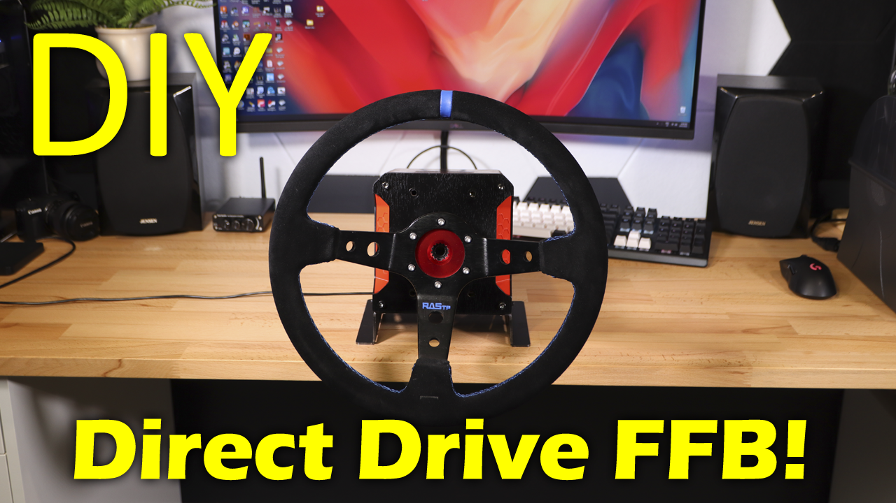

# CNCDan - FFBeast Wheel

This project is part of my DIY Sim racing series. It uses a modified hoverboard motor to create a powerful
direct drive FFB steering wheel!

Link to video 1: https://youtu.be/VL34nnuZUFQ

Link to video 2: https://youtu.be/ZE04ToZiPa0

There are two main folders, housing and motor. The housing folder contains the design and cut files for the housing components as well as the 3D model for the corner pieces.

The motor folder contains everything needed to complete the modification to the motor!

Refer to the official FFBeast project page for software and setup! https://ffbeast.github.io/

#### Bill of Materials

Motor controller - https://www.aliexpress.com/item/1005006480243178.html

Quick release - https://www.aliexpress.com/item/1005006059033942.html

Power Supply 24v LRS-350 - https://www.aliexpress.com/item/1005007107530077.html

Encoder - https://www.aliexpress.com/item/1005008666493796.html

2x 6202 Bearing - https://www.aliexpress.com/item/1005007524604474.html

XT60E-M Connector - https://www.aliexpress.com/item/1005005300313492.html

Power Switch - https://www.aliexpress.com/item/1005007352107442.html